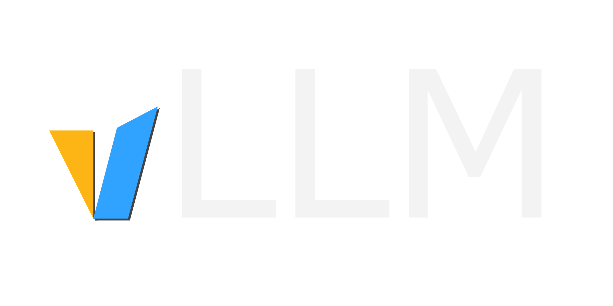

# vLLM Media Kit

This repository contains official logo assets for vLLM in various formats and styles.

## Logo Preview

### Full Logos

#### Light Mode

- [`vLLM-Full-Logo.svg`](vLLM-Full-Logo.svg) - Vector format
- [`vLLM-Full-Logo.png`](vLLM-Full-Logo.png) - PNG format

#### Dark Mode

- [`vLLM-Full-Dark-Mode-Logo.svg`](vLLM-Full-Dark-Mode-Logo.svg) - Vector format
- [`vLLM-Full-Dark-Mode-Logo.png`](vLLM-Full-Dark-Mode-Logo.png) - PNG format

### Compact Logos

- [`vLLM-Logo.svg`](vLLM-Logo.svg) - Vector format
- [`vLLM-Logo.png`](vLLM-Logo.png) - PNG format

## Usage Guidelines

### File Formats
- **SVG files**: Preferred for web use and scalable graphics. These vectors can be scaled to any size without loss of quality.
- **PNG files**: Best for situations where raster images are required. These are high-resolution files suitable for most purposes.

### When to Use Each Version
- **Full Logos**: Use when you have adequate horizontal space and want to showcase the complete branding.
- **Compact Logos**: Perfect for smaller spaces or when a more condensed branding element is needed.
- **Dark Mode Versions**: Specifically designed for dark backgrounds and dark mode interfaces.

## Best Practices
1. Maintain clear space around the logo
2. Don't modify or distort the logo proportions
3. Use the appropriate version for your background (light/dark)
4. When possible, use SVG format for better scaling

## Color Details

The yellow color is #fdb515 , RGB value (253, 181,  21).
The blue color is #30a2ff , RGB value (48, 162, 255).

## Questions
If you have questions about logo usage or need additional formats, please open an issue in this repository.
